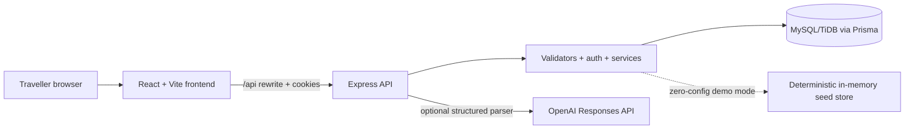

# Architecture

SmartBus Lite is a same-origin browser experience: the Vercel frontend rewrites `/api/*` to the Render API in production. The API issues a signed JWT only as a Secure, HttpOnly, `SameSite=Lax` cookie; the browser obtains a non-secret CSRF token and returns it for mutations.

## Booking transaction

`POST /api/bookings` validates one to six unique passengers, verifies the trip and seat ownership, then claims every selected seat inside one serialized transaction boundary. The booking group and all ticket rows are created only after every seat is available. If any seat is already taken, all work rolls back and the API returns `409 SEAT_UNAVAILABLE`.

The demo store models that boundary with an async mutex, letting the concurrent-booking test demonstrate the same observable behavior. The Prisma schema contains the required unique `tripId + seatNumber` constraint for the production database implementation.

## Data ownership

- A session identifies one user.
- A booking group belongs to one user and owns one or more ticket rows.
- A ticket maps one passenger and one seat to one trip.
- Cancellation checks session ownership, active status, and the trip cutoff before releasing only the relevant seat and recalculating group status.
