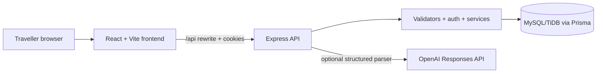

# Architecture

SmartBus Lite is a same-origin browser experience: the Vercel frontend rewrites `/api/*` to the Render API in production. The API issues a signed JWT only as a Secure, HttpOnly, `SameSite=Lax` cookie; the browser obtains a non-secret CSRF token and returns it for mutations.

## Booking transaction

`POST /api/bookings` validates one to six unique passengers, verifies the trip and seat ownership, then claims every selected seat inside one serialized transaction boundary. The booking group and all ticket rows are created only after every seat is available. If any seat is already taken, all work rolls back and the API returns `409 SEAT_UNAVAILABLE`.

Prisma runs this boundary as a serializable transaction. Each seat is changed with a conditional `AVAILABLE` update; if any update loses a race, the complete transaction rolls back and returns `409`. The integration suite exercises this behavior against MySQL rather than a mock client.

## Database lifecycle

The checked-in migration is the schema source of truth. Startup connects to the configured database and idempotently ensures the rolling demo dataset exists before accepting traffic. Seed IDs include the IST travel date, so reruns preserve historical bookings and do not reset seat state.

## Data ownership

- A session identifies one user.
- A booking group belongs to one user and owns one or more ticket rows.
- A ticket maps one passenger and one seat to one trip.
- Cancellation checks session ownership, active status, and the trip cutoff before releasing only the relevant seat and recalculating group status.
