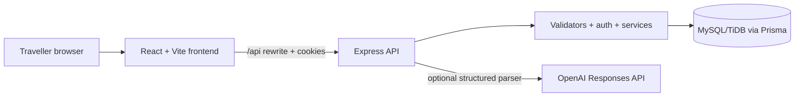

# Architecture

VoyageBus is a same-origin browser experience: the Vercel frontend rewrites `/api/*` to the deployed Render API in production. The API issues a signed JWT only as a Secure, HttpOnly, `SameSite=Lax` cookie; the browser obtains a non-secret CSRF token and returns it for mutations.

## Seat holding and booking transaction

Booking is a two-step server-orchestrated flow. `POST /api/holds` claims one to six seats for ten minutes; `POST /api/checkouts/confirm` turns a valid hold into tickets. Direct `POST /api/bookings` was removed (410) so no path can book a seat that was never held.

Both steps use ordered, conditional seat writes inside one transaction instead of `SERIALIZABLE` isolation, which TiDB does not support. A seat is claimable only when `AVAILABLE` or when its previous hold has expired, so an expired hold frees its seats logically with no cleanup timer. If any conditional write loses a race, the entire transaction rolls back and the API returns `409 SEAT_UNAVAILABLE`; a failed multi-seat hold leaves no partial ownership.

Confirmation persists a `PaymentAttempt` (unique on `userId` + `Idempotency-Key`, carrying the request fingerprint and payload) before invoking the simulated provider. Finalization rechecks the authenticated owner, hold validity, trip departure, and every seat's ownership, then claims all held seats to `BOOKED`, creates the PNR group and tickets, and marks the attempt `SUCCEEDED`. The unique `BookingGroup.holdId` plus the conditional attempt claim make duplicate or simultaneous confirmations resolve to the same PNR exactly once. Success arriving after hold expiry issues no ticket and marks the attempt `RECONCILIATION_REQUIRED`.

## Cancellation

Each booking group stores an immutable snapshot of the operator policy it was sold under. `GET /api/bookings/:ticketId/cancellation-quote` and the cancellation commit share one threshold calculation (`services/policies.ts`) with decimal money and IST departure instants; the commit recalculates because a quote can go stale. Concurrent cancellations of different tickets serialize on the group row (`SELECT ... FOR UPDATE` under `READ COMMITTED`, both MySQL- and TiDB-supported) so the final group status is correct.

## Database lifecycle

Checked-in migrations are the schema source of truth. Startup validates configuration, connects, applies migrations, seeds seven rolling days of demo trips idempotently (preserving booked rows and seat state), and cleans up expired demo accounts before accepting traffic; any failure crashes the boot.

## Production boundaries

The API emits structured JSON request/error logs plus domain events (`hold_conflict`, `payment_response_lost`, `confirmation_reconciled`, `ticket_cancelled`, `parser_fallback`, …) carrying the request ID; raw search text never enters telemetry. Liveness and database-readiness probes are separate. Search and booking history are paginated. CI verifies MySQL migrations, backend integration behavior, frontend units, production builds, and the Playwright booking/cancellation journey on desktop and mobile viewports.

## Data ownership

- A session identifies one user; demo sessions expire with their 24-hour synthetic accounts.
- A booking group belongs to one user and one hold, and owns one or more ticket rows.
- A ticket maps one passenger and one seat to one trip, priced from the hold's fare snapshot.
- Cancellation checks session ownership, active status, and the snapshot policy windows before releasing only the relevant seat and recalculating group status.
