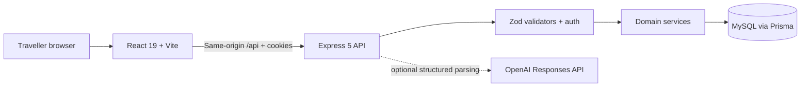

# VoyageBus

VoyageBus is a full-stack South India bus-booking application built to demonstrate production-minded software engineering, not just UI assembly. Travellers can search routes manually or in natural language, compare scheduled trips, inspect live seat state, reserve up to six seats atomically, retrieve grouped tickets, and cancel one passenger without changing the rest of the booking.

The product identity is intentionally calm and information-first: a quiet digital departure lounge where route, time, fare, and seat state stay easy to trust.

## Engineering highlights

- **Race-safe seat booking:** a serializable Prisma transaction conditionally claims every requested seat and rolls the complete operation back when any seat loses a race.
- **Real persistence:** MySQL is the source of truth; there is no in-memory production fallback. Migrations and idempotent rolling seed data are checked in.
- **Secure browser session:** Argon2id password hashes, Secure/HttpOnly signed session cookies, double-submit CSRF protection, Helmet, credentialed CORS allowlists, bounded JSON input, and route-specific rate limits.
- **Constrained AI assistance:** optional structured OpenAI parsing only proposes editable filters. A deterministic parser keeps search available without a provider key, and inventory always comes from the database.
- **Complete booking lifecycle:** multi-passenger PNR groups, ticket-level cancellation, server-calculated mock refunds, conflict recovery, pagination, and accessible loading/error/empty states.
- **Operational proof:** database readiness and process liveness are separate, request logs are structured, CI provisions MySQL, and the primary journey is covered from unit tests through Playwright.

## Architecture



The frontend never decides whether a seat is available. It submits the selected seat numbers, and the API establishes ownership inside one transaction. See [ARCHITECTURE.md](ARCHITECTURE.md) for the boundaries and [API_DOCS.md](API_DOCS.md) for the HTTP contract.

## Product flow

1. Search one of six seeded South India corridors for today or tomorrow.
2. Filter departures and inspect authoritative seat availability.
3. Select up to six seats and enter traveller details.
4. Sign in or use the demo account, then confirm a simulated payment.
5. Retrieve the PNR group and cancel individual active tickets before the cutoff.

## Quick start

Prerequisites: Node.js 22+, Docker, and npm.

```bash
cp backend/.env.example backend/.env
cp frontend/.env.example frontend/.env
npm ci --prefix backend
npm ci --prefix frontend
docker compose up -d
npm run db:deploy --prefix backend
npm run db:seed --prefix backend
npm run dev --prefix backend
npm run dev --prefix frontend
```

Open `http://localhost:5173`. The API runs at `http://localhost:4000` and local MySQL is published on port `3307`.

Demo account:

- Email: `demo@voyagebus.in`
- Password: `VoyageBus123!`

`OPENAI_API_KEY` is optional. Manual search and the deterministic natural-language parser work without it.

## Verification

```bash
npm run typecheck --prefix backend
npm run test:integration --prefix backend
npm test --prefix frontend
npm run lint --prefix frontend
npm run format:check --prefix frontend
npm run build --prefix frontend
npm run test:e2e --prefix frontend
```

| Layer | What it proves |
| --- | --- |
| Backend integration | migrations, persistence, auth, input errors, concurrency, rollback, cancellation ownership, and parser fallback |
| Frontend unit | auth redirect preservation, checkout state isolation, passenger editing, and accessible seat behavior |
| Playwright | login → search → two-seat booking → confirmation → partial and final cancellation |
| CI | clean installation, MySQL service health, every check above, and Chromium setup |

## Repository map

- `frontend/` — React, React Router, TanStack Query, React Hook Form, Zod, Zustand, and responsive CSS
- `backend/` — Express routes, middleware, services, validation, logging, and integration tests
- `backend/prisma/` — schema, migration, and deterministic seed entrypoint
- `docs/` — PRD, technical requirements, app flow, UI brief, schema rules, implementation plan, and operations runbook
- `.github/workflows/` — CI, production readiness monitoring, and database backup automation

## Deployment

The frontend is configured for Vercel and proxies `/api/*` to the deployed API. The backend includes a production Dockerfile plus Railway/Render-compatible configuration. Apply migrations as a pre-deploy step and use `/api/ready` as the database-aware health check. Full deployment and recovery guidance lives in [docs/07-OPERATIONS.md](docs/07-OPERATIONS.md).

## Deliberate scope

VoyageBus does not process money. Payment, refunds, coupons, insurance, live GPS, email delivery, and operator administration are explicitly outside this demo. The UI labels simulated behavior plainly; the engineering focus is correctness, security boundaries, state design, and a complete booking lifecycle.

Future production work would add payment-provider idempotency, email verification and recovery, distributed rate limiting, session revocation, metrics/tracing, and provider-backed ticket notifications.
