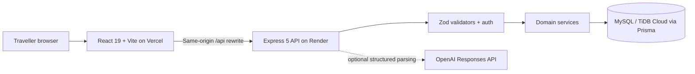

# VoyageBus

A bus-booking prototype for South Indian routes. Travellers search in plain English or with a form, pick seats on a live map, hold them for ten minutes, pay through a simulated checkout, and cancel individual tickets under operator-specific refund policies. A reviewer can walk the whole journey in about a minute, including the concurrency safety nets described below.

The visual direction is calm and information-first: route, time, fare, and seat state stay readable and trustworthy.

## The 30-second demo

1. Search Hyderabad → Bengaluru for tomorrow, or type something like `AC sleeper from Hyd to Bangalore tomorrow night under ₹1200` and edit the parsed filters before searching.
2. Choose up to six seats and continue. Anonymous visitors are offered a private demo session: an isolated account that lasts 24 hours, with no signup.
3. The server now holds those seats. A countdown shows the time remaining, and refreshing the page restores the same hold from the URL.
4. Enter one traveller per seat and confirm the simulated payment. Nothing is charged. You receive a PNR with one ticket per seat.
5. From My bookings, cancel a single ticket. The dialog quotes the refund from the operator's policy window before you confirm, and the commit recalculates that quote in case the window moved while you decided.

The free-tier deployment sleeps when idle. The static site loads immediately and shows a "starting the demo" screen while the API wakes, which usually takes about a minute.

## What the backend guarantees

**Holds are all-or-nothing and expire logically.** Creating a hold claims every selected seat in one transaction with ordered, conditional writes. If any seat loses a race, the whole hold rolls back. An expired hold frees its seats the moment it lapses; there is no cleanup timer to wait for. Seats carry the authoritative state: `AVAILABLE`, `HELD` (with hold id and expiry), or `BOOKED`.

**Bookings survive races, replays, and crashes.** Seat claiming uses conditional writes instead of `SERIALIZABLE` isolation, which TiDB does not support, so the same code runs on MySQL and TiDB. Each confirmation persists a `PaymentAttempt` before calling the mock provider, and a unique `(userId, idempotencyKey)` plus a unique `BookingGroup.holdId` mean a retried or simultaneous confirmation produces the same PNR exactly once. A declined payment leaves the hold alive for a retry with a new key. A payment response lost in transit, even across a server restart, resolves to the same ticket. A simulated success that arrives after the hold expired issues no ticket and marks the attempt `RECONCILIATION_REQUIRED`.

**Cancellation terms are versioned and server-calculated.** Two clearly fictional operators ship different policies: Marigold Trail Travels refunds 90/70/40% at 72/24/6 hours before departure, Peacock Roadways refunds 85/60/25% at 48/12/3 hours, and both close cancellation near departure. Each sold booking snapshots the policy it was sold under, so a later operator edit cannot reprice it. Quotes and the cancellation commit share one calculation with decimal money and IST departure handling. Concurrent cancellations of different tickets in one booking serialize on the group row, so the final group status is correct.

**AI proposes, the database decides.** The optional OpenAI integration only extracts editable search filters. A deterministic offline parser answers when no key is configured or the provider fails, a versioned eval corpus covers route, date, and filter extraction plus latency, and inventory never comes from the model.

**Sessions are guarded.** Argon2id password hashes, HttpOnly JWT cookies, double-submit CSRF on every mutation, Helmet, bounded JSON input, and per-route rate limits. Demo accounts expire with their session tokens, and expired demo data is cleaned up in bounded batches.

## Architecture



The frontend never decides whether a seat is available; it sends seat numbers and the API establishes ownership in a transaction. Boundaries are in [ARCHITECTURE.md](ARCHITECTURE.md), the HTTP contract in [API_DOCS.md](API_DOCS.md).

## Run it locally

Prerequisites: Node.js 22+, Docker, npm.

```bash
cp backend/.env.example backend/.env
cp frontend/.env.example frontend/.env
npm ci --prefix backend
npm ci --prefix frontend
docker compose up -d
npm run dev --prefix backend     # applies migrations, seeds 7 rolling days, then listens
npm run dev --prefix frontend
```

Open http://localhost:5173. The API listens on port 4000 and MySQL on 3307. A failed migration or seed fails startup; the API does not serve traffic against a stale schema. `OPENAI_API_KEY` is optional.

## Verification

```bash
npm run typecheck --prefix backend
npm run test:integration --prefix backend   # real MySQL: races, replay, restart, expiry, cancellation
npm test --prefix frontend                  # unit + policy-independent UI behavior
npm run lint --prefix frontend
npm run format:check --prefix frontend
npm run build --prefix frontend
npm run test:e2e --prefix frontend          # full journey on desktop and a 390px viewport
```

The backend integration suite covers hold races with a single winner, multi-seat rollback, expired holds taken over by another user, duplicate and concurrent idempotency keys resolving to one PNR, payment failure and new-key retry, lost responses recovered across a database reconnect, late success flagged for reconciliation, policy window boundaries and rounding, snapshot immutability after an operator re-versions, concurrent cancellation of two tickets in one group, and unauthorized access. To run the same suite against TiDB Cloud, point `DATABASE_URL` at the Starter cluster and rerun `test:integration`.

CI runs all of the above on every push with a fresh MySQL service container.

## Deployment

The demo targets a $0 stack: Vercel static frontend, Render free-tier Express API (`render.yaml`), TiDB Cloud Starter database with the spending limit set to zero. `vercel.json` rewrites `/api/*` to the Render service so cookies stay same-origin.

Honest free-tier limits: Render sleeps after 15 idle minutes and takes roughly a minute to wake (the frontend gate handles this within Vercel's 120-second proxy limit), and TiDB Starter's automatic backups retain one day. Migrations and the rolling seed run at boot before the API accepts traffic. Full runbook: [docs/07-OPERATIONS.md](docs/07-OPERATIONS.md).

## Repository map

- `frontend/` — React, React Router, TanStack Query, React Hook Form, Zod, Zustand, responsive CSS
- `backend/` — Express routes, middleware, services, validators, integration tests
- `backend/prisma/` — schema, migrations, deterministic seed
- `docs/` — product, requirements, flow, schema, and operations documents
- `AI_BUILD_LOG.md` — what the AI assistant actually did, with evidence

## Scope and limitations

VoyageBus moves no money. Payments, refunds, operators, schedules, and reviews are simulated, and the operators are fictional. The API is a single Express instance; there is no message queue, distributed rate limiting, or metrics pipeline. Boarding points and a privacy-conscious funnel are follow-up work. No reliability claims beyond what the tests demonstrate.
