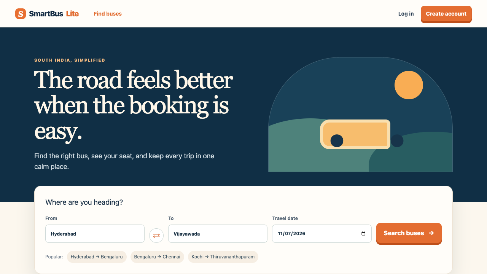
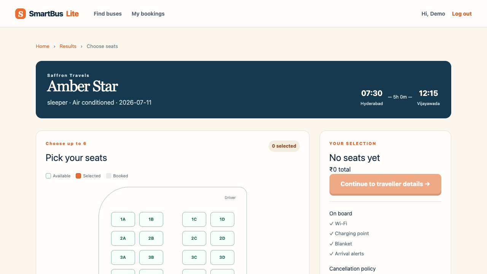
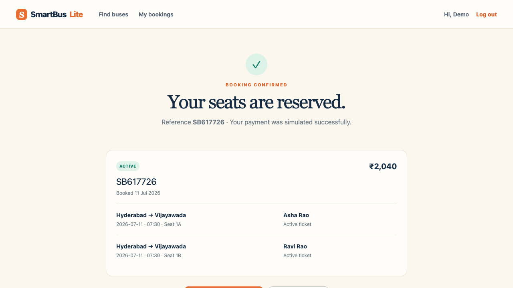

# SmartBus Lite

SmartBus Lite is a portfolio-ready South India bus-booking MVP. It supports manual and natural-language trip search, visible seat availability, protected multi-seat mock bookings, ticket-level cancellation, and a calm warm-travel interface.

## Quick start

```bash
cp backend/.env.example backend/.env
cp frontend/.env.example frontend/.env
npm install --prefix backend
npm install --prefix frontend
npm run dev --prefix backend
npm run dev --prefix frontend
```

Open `http://localhost:5173`. The API runs at `http://localhost:4000`.

Use the seeded demo account:

- Email: `demo@smartbus.in`
- Password: `SmartBus123!`

## What is included

- Six seeded South India routes and 24 IST trips across today and tomorrow
- Manual search, filters, empty/loading/error states, and responsive trip cards
- Offline deterministic natural-language parsing (works with no OpenAI key)
- HttpOnly signed session cookie, CSRF double-submit token, Helmet, CORS, Argon2id hashes
- Server-authoritative, up-to-six-seat mock booking with atomic conflict handling
- PNR-style confirmation, grouped booking history, and ticket-level mock cancellation/refund

## Architecture

- `frontend/` — React 19, Vite, React Router, TanStack Query, React Hook Form, Zod, Axios, Zustand
- `backend/` — Express 5, TypeScript, security middleware, API routes/services/validators
- `backend/prisma/schema.prisma` — MySQL/TiDB production data contract
- `docs/` — product, technical, flow, visual, schema, and implementation source documents

Read [ARCHITECTURE.md](ARCHITECTURE.md) and [API_DOCS.md](API_DOCS.md) for the implementation details.

## Verification

```bash
npm run typecheck --prefix backend
npm test --prefix backend
npm run build --prefix frontend
npm run lint --prefix frontend
```

## Screenshots







## Local database and deployment

`docker compose up -d` starts the MySQL-compatible local database described by `DATABASE_URL`. The Prisma schema has the intended persistent MySQL/TiDB model. The checked-in runtime defaults to an in-memory seeded store so reviewers can run the full demo without provisioning a database; it resets on API restart. Moving to production means implementing the existing schema with Prisma repositories, setting a strong `JWT_SECRET`, and setting `FRONTEND_ORIGIN` to the Vercel URL.

For production, deploy the frontend to Vercel and rewrite `/api/*` to the Render service. TiDB Cloud Starter is appropriate for a small demo only; apply spend limits and use a persistent-disk database before relying on it for real users.

## Limitations and future work

- No real payments, payment tokens, refunds, insurance, coupons, boarding points, live tracking, or operator portal
- API data is intentionally ephemeral in the local zero-config MVP mode
- Add Prisma migrations/repositories, OpenAI Responses structured outputs, Playwright coverage, and deployment manifests before a production release
