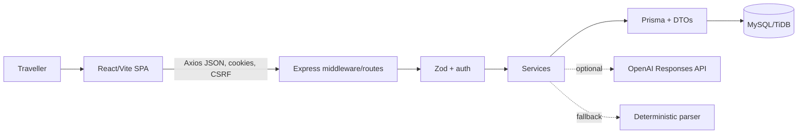
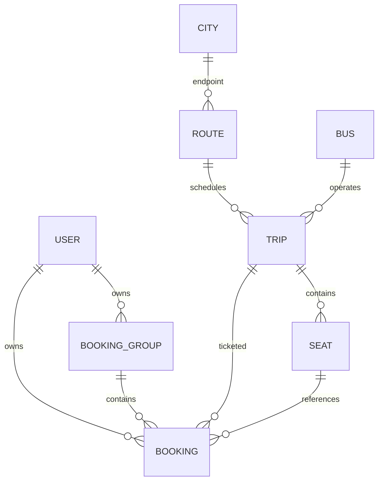
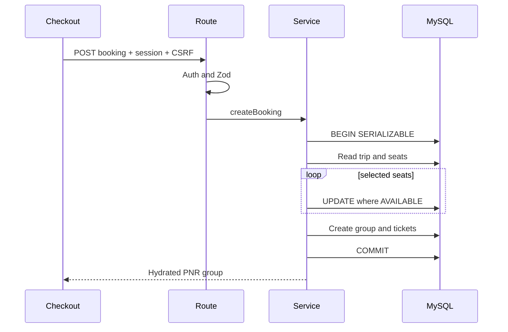

# VoyageBus interview codebase notes

> Evidence scope: tracked repository inspected 2026-07-12. Citations are repository-relative `file:start-end`. “Not confirmed from codebase” is used where appropriate.

# 1. Project interview summary

VoyageBus (older code/docs also say SmartBus Lite) is a full-stack South India bus-booking portfolio app. Travellers search routes manually or with natural language, filter trips, inspect seat availability, register/login, reserve up to six seats, view a PNR-style booking group, and cancel individual tickets. The target user/problem is stated in `PRODUCT.md:7-17`; implemented scope is in `README.md:26-40`.

Its central engineering problem is not rendering seats but preserving the invariant “one active owner per seat” when browsers race. The backend solves that with server validation, conditional seat updates, and a serializable MySQL transaction (`backend/src/services/bookings.ts:15-49`). Payments, refunds, operator inventory, tracking, insurance and coupons are simulated or absent (`README.md:77-81`).

Stack: React 19/Vite/Router/TanStack Query/Zustand/React Hook Form/Zod/Axios; Express 5/TypeScript/Zod/JWT cookies/Argon2id/Prisma; MySQL/TiDB; optional OpenAI Responses API; Vitest/Supertest/Testing Library/Playwright (`frontend/package.json:14-49`, `backend/package.json:23-48`).

Interview highlights:

- Atomic multi-seat booking and rollback, race-tested on real MySQL (`backend/src/services/bookings.ts:15-49`, `backend/src/app.test.ts:82-116`).
- Atomic ticket cancellation, seat release, refund calculation and group-state recomputation (`backend/src/services/bookings.ts:66-92`).
- HttpOnly JWT cookie plus double-submit CSRF (`backend/src/middleware/auth.ts:12-30`).
- Strict-schema LLM extraction with local Zod validation and offline fallback (`backend/src/services/ai-parser.ts:37-65`).
- DTO boundary for Decimal/Date/JSON and safe public shapes (`backend/src/data/dto.ts:3-85`).

**30-second pitch:** “VoyageBus is a React, Express, Prisma and MySQL booking demo. Users search South India routes, choose seats, make authenticated multi-passenger bookings and cancel individual tickets. The centerpiece is a serializable conditional seat-claim transaction that guarantees only one concurrent user can reserve a seat. It also includes cookie/CSRF security, validation, pagination, structured logging and optional schema-constrained AI search.”

**60-second pitch:** Add: “TanStack Query owns server state, Zustand owns small UI/session state, and route handlers delegate business invariants to services. A checkout creates one PNR group and several tickets only after every seat is claimed. Real-MySQL integration tests deliberately race requests. It is an honest portfolio demo: money and inventory integrations are simulated.”

**2-minute pitch:** Walk through Home → Search → SeatMap → Checkout → `POST /api/bookings` → serializable transaction → confirmation → cancellation. Close with tradeoffs: stateless JWTs lack revocation, rate limits are process-local, startup seeding occurs after listening, and payment/idempotency/observability are incomplete.

# 2. Prerequisites I must know before explaining this project

| Concept | First principles, code and interview explanation |
|---|---|
| Client/server + HTTP/REST | Browser sends method/path/headers/body; server returns status/headers/JSON. The client proposes and the server authoritatively validates (`frontend/src/lib/api.ts:4-27`, `backend/src/app.ts:19-51`). GET reads, POST creates, PATCH changes. |
| JSON contracts/DTOs | ORM values are not automatically good public contracts. DTOs convert Decimal/Date/relations and avoid leaking hashes (`backend/src/data/dto.ts:3-85`, `frontend/src/types.ts:1-11`). |
| Validation | TypeScript disappears at runtime; Zod parses untrusted input into bounded types (`backend/src/validators.ts:1-17`). Frontend validation improves UX; backend validation is the security boundary (`frontend/src/pages/Auth.tsx:10-16`). |
| Authentication/authorization | Auth identifies a user via signed JWT cookie (`backend/src/middleware/auth.ts:12-24`). Authorization compares that id to object ownership (`backend/src/services/bookings.ts:60-74`). UI guards are not enforcement. |
| Cookies/CSRF | Browsers attach cookies automatically, so unsafe methods require a second token echoed in a header (`backend/src/middleware/auth.ts:26-30`, `frontend/src/lib/api.ts:5-7`). HttpOnly prevents JS reads; SameSite restricts cross-site sends. |
| Relational DB/ORM | PKs identify rows, FKs preserve relationships, unique constraints preserve invariants (`backend/prisma/schema.prisma:27-119`). Prisma produces parameterized SQL but engineers must still reason about queries/indexes (`backend/src/data/prisma.ts:16-34`). |
| Migrations | Version-controlled schema changes run before deployment (`backend/prisma.config.ts:4-7`, `backend/package.json:12-16`, `backend/prisma/migrations/20260711000000_init/migration.sql:1-102`). |
| Transactions/isolation | A transaction commits every write or none. Serializable isolation makes concurrent results equivalent to a serial order (`backend/src/services/bookings.ts:18-45,69-88`). |
| Indexes/pagination | Indexes trade write/storage cost for read speed; pagination bounds rows/payload (`backend/prisma/schema.prisma:76,116-118`, `backend/src/services/search.ts:39-46`). |
| Errors/logging/rate limits | Stable codes let clients respond safely; unknown errors are logged and hidden (`backend/src/utils/http.ts:12-16`). JSON request logs include id/status/duration (`backend/src/config/logger.ts:11-16`). Limits reduce abuse (`backend/src/middleware/rate-limit.ts:1-8`). |
| React state | TanStack Query caches remote truth, Zustand stores small cross-route UI state, React Hook Form owns transient forms (`frontend/src/main.tsx:10-14`, `frontend/src/store.ts:1-5`, `frontend/src/pages/Checkout.tsx:10-17`). |
| SPA vs Next.js | This is a client-rendered Vite SPA using BrowserRouter; there are no Next.js server/client components (`frontend/src/main.tsx:11-14`, `frontend/src/App.tsx:1-12`). |
| AI structured output | Probabilistic output is restricted by JSON Schema and verified by Zod; a deterministic parser preserves availability (`backend/src/services/ai-parser.ts:15-65`). The LLM extracts filters, never availability. |
| Testing/deployment | Units test isolated rules, integration tests use API+MySQL, E2E tests use a browser (`backend/src/app.test.ts:19-153`, `frontend/e2e/booking.spec.ts:3-34`). Env vars and readiness separate configuration/dependency health (`backend/src/config/env.ts:3-15`, `backend/src/app.ts:28-43`). |

Not implemented: multi-tenancy, uploads, webhooks, workers/queues, caching, RAG/embeddings/vector search, real payments, or server components.

# 3. High-level architecture



Frontend entry/providers/routes are `frontend/src/main.tsx:1-14` and `frontend/src/App.tsx:1-12`. Middleware order is Helmet → CORS → JSON → cookies → logger → limit → CSRF → routers → errors (`backend/src/app.ts:16-51`). Routers translate HTTP; services own rules; DTOs serialize persistence (`backend/src/routes/bookings.ts:7-12`, `backend/src/services/bookings.ts:15-92`, `backend/src/data/dto.ts:23-85`). Runtime is static Vite on Vercel plus Node/Docker backend (`vercel.json:1-5`, `backend/Dockerfile:1-33`).

# 4. Repository map

| Path | Responsibility and interview importance |
|---|---|
| `frontend/src/main.tsx:1-14` | SPA entry, Query/Router/Toast providers. |
| `frontend/src/App.tsx:1-12` | Route table and client auth guard. |
| `frontend/src/pages/*.tsx` | Screen orchestration and user flows. |
| `frontend/src/components/SeatMap.tsx:3-5` | Controlled, accessible six-seat selector. |
| `frontend/src/lib/api.ts:4-27` | Axios contract, cookie and CSRF behavior. |
| `frontend/src/store.ts:1-5` | User/auth-ready/selected-seat UI state. |
| `backend/src/server.ts:7-22` | Process startup, DB, seed, signals. |
| `backend/src/app.ts:16-51` | Express composition root and route registration. |
| `backend/src/routes/` | HTTP adapters. |
| `backend/src/services/` | Queries and business invariants. |
| `backend/src/validators.ts:1-17` | Runtime request contracts. |
| `backend/src/middleware/` | JWT, CSRF, rate limiting. |
| `backend/src/data/prisma.ts:1-34` | Prisma adapter/client lifecycle and TLS flags. |
| `backend/src/data/dto.ts:3-85` | Public serialization boundary. |
| `backend/src/data/seed.ts:6-84` | Rolling deterministic demo dataset. |
| `backend/prisma/schema.prisma:1-119` | Models/relations/indexes. |
| `backend/prisma/migrations/20260711000000_init/migration.sql:1-102` | Initial deployed DDL. |
| `backend/src/app.test.ts:19-153` | MySQL-backed API/concurrency tests. |
| `frontend/e2e/booking.spec.ts:3-34` | Browser booking/cancellation journey. |
| `.github/workflows/ci.yml:1-39` | Full CI with MySQL. |
| `docker-compose.yml:1-22`, `render.yaml:1-24`, `vercel.json:1-5` | Local DB and deployment assumptions. |

Lockfiles pin dependencies; images/screenshots are UI evidence; build/test outputs and `node_modules` are generated, not business logic.

# 5. Runtime and startup flow

Backend scripts execute `src/server.ts` through `tsx` (`backend/package.json:6-17`). `start()` validates env, connects MySQL, listens, then starts demo seeding without awaiting it; signals close HTTP then Prisma (`backend/src/server.ts:7-16`). A seed failure is logged but does not stop readiness (`backend/src/server.ts:11-13`). Also imports occur before `validateEnvironment`, so a missing `DATABASE_URL` can throw during module initialization (`backend/src/data/prisma.ts:5-7`).

Frontend Vite proxies `/api` to port 4000 (`frontend/vite.config.ts:6-12`). `main.tsx` mounts providers; Layout calls `/auth/me` and sets `authReady` when completed (`frontend/src/components/Layout.tsx:8-13`). Production Docker generates Prisma and typechecks but runs TS via `tsx` (`backend/Dockerfile:1-33`). Migrations are pre-deploy (`render.yaml:6-9`).

Validated env: `DATABASE_URL`, `JWT_SECRET`, `FRONTEND_ORIGIN`, `PORT`, `NODE_ENV` (`backend/src/config/env.ts:3-15`). Also read elsewhere: `OPENAI_API_KEY`, `OPENAI_MODEL`, `LOG_LEVEL`, `SEED_DATE` (`backend/.env.example:1-9`).

# 6. Database deep dive

- `User`: UUID PK, unique email, Argon2 hash (`backend/prisma/schema.prisma:27-35`).
- `City`/`Route`: source and destination relations; unique pair (`backend/prisma/schema.prisma:36-50`).
- `Bus`: operator/type/AC/JSON amenities (`backend/prisma/schema.prisma:51-59`).
- `Trip`: route, bus, date, zero-padded time strings, Decimal fare/policy; `(routeId,travelDate)` index (`backend/prisma/schema.prisma:60-77`).
- `Seat`: per-trip position/status; unique `(tripId,seatNumber)` (`backend/prisma/schema.prisma:78-89`).
- `BookingGroup`: owner, unique PNR, aggregate status (`backend/prisma/schema.prisma:90-98`).
- `Booking`: passenger ticket, group/user/trip/seat, fare snapshot and cancellation/refund (`backend/prisma/schema.prisma:99-119`).



The migration implements matching PKs/FKs/unique/index/Decimal/JSON constraints with RESTRICT deletes (`backend/prisma/migrations/20260711000000_init/migration.sql:1-102`). Seed derives stable UUID-shaped ids, upserts static rows, creates 24 trips across today/tomorrow, and preserves booked seats (`backend/src/data/seed.ts:18-84`; test `backend/src/app.test.ts:53-62`).

Risks: no DB constraint independently forbids two active bookings per seat; correctness relies on `Seat.status` transaction logic. `Booking.userId` duplicates group owner and `Seat.status` duplicates derived booking state. No natural unique trip constraint. Search loads every seat to count availability (`backend/src/data/dto.ts:3-7`, `backend/src/services/search.ts:42-46`). Booking history likely needs `(userId,createdAt)` index.

Interview answers: Group+ticket supports one PNR with independently cancellable passengers. Decimal avoids binary floating-point storage; DTOs convert at the browser edge (`backend/src/data/dto.ts:32-34,78-81`). RESTRICT protects historical references but requires explicit deletion policy.

# 7. API deep dive

Global unsafe-method CSRF and `/api` rate limiting occur before routers (`backend/src/app.ts:24-26`). Zod→422, domain errors→declared status/code, unknown→logged safe 500 (`backend/src/utils/http.ts:12-16`).

## Endpoint: `GET /api/health`, `GET /api/ready`

Health returns process OK without dependencies; readiness executes fixed `SELECT 1` and returns 503 when MySQL fails (`backend/src/app.ts:28-43`). Deployment/E2E use readiness (`render.yaml:9`, `frontend/playwright.config.ts:11-14`).

## Endpoint: `GET /api/auth/csrf`

Returns 24 random bytes as hex and a readable SameSite cookie (`backend/src/routes/auth.ts:13-17`). Axios caches and echoes it in unsafe request headers (`frontend/src/lib/api.ts:5-7`). It has no expiry, rotation, or session binding.

## Endpoint: `POST /api/auth/register`

Body `{name,email,password}`. Shared schema is tightened to require name, email is lowercased, password Argon2id-hashed, user created, JWT cookie issued, safe user returned as 201; duplicate email is 409 (`backend/src/validators.ts:3`, `backend/src/routes/auth.ts:19-29`, `backend/src/middleware/auth.ts:12-15`). Caller/form: `frontend/src/lib/api.ts:15`, `frontend/src/pages/Auth.tsx:10-17`. Missing email verification/password reset/lockout.

## Endpoint: `POST /api/auth/login`, `POST /logout`, `GET /me`

Login validates, loads normalized email, verifies Argon2, issues session (`backend/src/routes/auth.ts:31-37`). Logout only clears cookie; stolen JWT is not revoked (`backend/src/routes/auth.ts:39-42`). `/me` verifies JWT and reloads safe user (`backend/src/middleware/auth.ts:17-24`, `backend/src/routes/auth.ts:44-48`). Layout restores session through it (`frontend/src/components/Layout.tsx:8-13`).

## Endpoint: `GET /api/routes/search`

No/both-missing params list routes; both source+destination resolve one case-normalized route or 404 (`backend/src/routes/routes.ts:6-13`, `backend/src/services/search.ts:6-21`). One param silently lists all. Called by Home/Search (`frontend/src/pages/Home.tsx:12-15`, `frontend/src/pages/Search.tsx:8-12`). Params lack Zod length validation.

## Endpoint: `GET /api/buses`

Validated filters include route/date/price/AC/type/departure/sort/page/pageSize (`backend/src/validators.ts:6-17`). Service constructs Prisma where/order and transactionally returns rows+count (`backend/src/services/search.ts:24-46`); route shapes cards/pagination (`backend/src/routes/buses.ts:13-22`). Caller: `frontend/src/pages/Search.tsx:9-15`. Public, max 50 rows; full seats are unnecessarily fetched to count.

## Endpoint: `GET /api/buses/trip/:tripId`, `GET /api/buses/:id?tripId=`

Return trip card+seats+policy. First identifies trip only; second verifies bus/trip pair (`backend/src/routes/buses.ts:9-11,24-26`, `backend/src/services/buses.ts:5-20`). Detail uses pair; checkout uses trip-only (`frontend/src/lib/api.ts:21-22`). Params are not Zod validated.

## Endpoint: `POST /api/bookings`

Requires session+CSRF. Body has trip id and 1–6 unique `{seatNumber,name,age}` rows; seat regex is `digit + A-D` (`backend/src/validators.ts:4`, `backend/src/routes/bookings.ts:7-10`). Service verifies trip/seats, conditionally changes AVAILABLE seats, creates group+tickets in one serializable transaction, retries PNR unique conflict and maps races to 409 (`backend/src/services/bookings.ts:15-49`). Caller: `frontend/src/pages/Checkout.tsx:15-19`. Missing idempotency/replay of a committed response.

## Endpoint: `GET /api/bookings/me`, `GET /api/bookings/group/:id`

Require JWT. History validates pagination and queries owner groups newest-first; single group checks ownership and returns 403 for missing/foreign (`backend/src/routes/bookings.ts:8-11`, `backend/src/services/bookings.ts:52-63`). Called by `frontend/src/pages/Bookings.tsx:7-9`.

## Endpoint: `PATCH /api/bookings/:id/cancel`

Requires JWT+CSRF. It checks owner/ACTIVE/cutoff, calculates rounded mock refund, conditionally cancels, releases seat, counts tickets and updates group status atomically (`backend/src/services/bookings.ts:66-92`). Modal/caller: `frontend/src/pages/Bookings.tsx:11`, `frontend/src/lib/api.ts:27`. UI hardcodes 90%/six hours instead of policy data.

## Endpoint: `POST /api/ai/parse-search`

Validates 2–220 character query, invokes optional OpenAI or fallback, returns editable fields (`backend/src/validators.ts:5`, `backend/src/routes/ai.ts:6-7`, `backend/src/services/ai-parser.ts:47-65`). CSRF required, auth not required, 20/minute limit (`backend/src/app.ts:26,49`, `backend/src/middleware/rate-limit.ts:8`).

# 8. Frontend deep dive

This is a client SPA. `App` defines Home, Search, Bus Details, Login/Register, protected Checkout, Confirmation and My Bookings (`frontend/src/App.tsx:1-12`). `Protected` is only UX; API auth is enforcement.

- **Home:** loads route suggestions, holds manual/AI fields, serializes filters into URL search params (`frontend/src/pages/Home.tsx:7-20`). Parsed fields are editable. Manual inputs lack schema errors. “24 seeded daily trips” is inaccurate: seeding creates 24 across two days (`frontend/src/pages/Home.tsx:19`, `backend/src/data/seed.ts:53-82`).
- **Search:** URL owns filters/page; route query enables trip query; skeleton/error/empty/pagination states are explicit (`frontend/src/pages/Search.tsx:8-16`). Errors share generic copy. `params.toString()` can create redundant cache keys.
- **Bus detail:** fetches authoritative seats, renders `SeatMap`, stores selection in Zustand, computes display total and navigates (`frontend/src/pages/BusDetails.tsx:7-13`). Major bug: global selected seats are not keyed/cleared by trip, so previous-trip seats can leak into another trip.
- **SeatMap:** blocks booked seats, toggles selection, caps six and supplies disabled/pressed/aria labels (`frontend/src/components/SeatMap.tsx:3-5`). Server remains authoritative.
- **Auth:** React Hook Form+Zod validates; mutation sets Zustand/Query cache and returns to attempted path (`frontend/src/pages/Auth.tsx:10-19`).
- **Checkout:** rebuilds passenger array from selected seats, fetches fare, books, clears selection and navigates (`frontend/src/pages/Checkout.tsx:10-19`). It does not explicitly render trip loading/error; age lacks client `.int()` though server requires integer.
- **Bookings:** protected queries show grouped tickets; cancellation modal traps focus and updates caches (`frontend/src/pages/Bookings.tsx:7-11`). Displayed refund/cutoff are hardcoded.
- **Styling:** Tailwind is imported, but most UI is dense global CSS/media queries (`frontend/src/index.css:1-3`, imports `frontend/src/main.tsx:5-6`). Appropriate for a small app but difficult to modularize.

# 9. Auth and security deep dive

```mermaid
sequenceDiagram
  participant B as Browser
  participant E as Express
  participant D as MySQL
  B->>E: GET /auth/csrf
  E-->>B: token + readable cookie
  B->>E: POST /auth/login + token header
  E->>D: Find user
  E->>E: Argon2 verify; sign JWT
  E-->>B: safe user + HttpOnly session
  B->>E: Protected request + cookie
  E->>E: Verify JWT; attach userId
```

Strengths: Argon2id (`backend/src/routes/auth.ts:22,34`); HttpOnly/Secure-production/SameSite cookie (`backend/src/middleware/auth.ts:12-15`); Helmet, credentialed allowlisted CORS and 100KB JSON cap (`backend/src/app.ts:19-22`); global CSRF (`backend/src/middleware/auth.ts:26-30`); service ownership checks (`backend/src/services/bookings.ts:60-74`); Prisma parameterization; no raw HTML injection.

Weaknesses:

- JWT has no issuer/audience, token version, rotation, server session or revocation (`backend/src/middleware/auth.ts:12-23`).
- Development fallback signing secret exists (`backend/src/middleware/auth.ts:5-9`).
- CSRF token is unexpired/unbound/reusable and logout leaves it (`backend/src/routes/auth.ts:13-16,39-42`).
- Rate limits are process-local, not coordinated across replicas (`backend/src/middleware/rate-limit.ts:1-8`).
- No email verification, reset, MFA, audit trail, account lockout or roles. Not confirmed from codebase.
- CORS origins are split without trimming (`backend/src/app.ts:20`).

# 10. Core feature flows end-to-end

## Search/seat flow

Home creates URL (`frontend/src/pages/Home.tsx:11-17`) → Search resolves route (`frontend/src/pages/Search.tsx:9-12`) → route handler/service (`backend/src/routes/routes.ts:6-13`, `backend/src/services/search.ts:13-21`) → validated buses endpoint (`backend/src/validators.ts:8-17`, `backend/src/routes/buses.ts:13-22`) → paginated Prisma search (`backend/src/services/search.ts:24-46`) → detail service (`backend/src/services/buses.ts:5-14`) → SeatMap.

## Auth flow

Form Zod (`frontend/src/pages/Auth.tsx:10-16`) → fetch CSRF/post (`frontend/src/lib/api.ts:5-16`) → CSRF middleware (`backend/src/middleware/auth.ts:26-30`) → route validates/hashes or verifies (`backend/src/routes/auth.ts:19-37`) → JWT cookie (`backend/src/middleware/auth.ts:12-15`) → store/cache/navigate. Refresh calls `/me` (`frontend/src/components/Layout.tsx:8-13`).

## Atomic booking



Evidence: UI/API `frontend/src/pages/Checkout.tsx:15-19`, `frontend/src/lib/api.ts:24`; route/schema `backend/src/routes/bookings.ts:8-10`, `backend/src/validators.ts:4`; transaction `backend/src/services/bookings.ts:15-49`; DB `backend/prisma/schema.prisma:78-118`. Thrown conflicts roll back earlier claims. Race/rollback tests: `backend/src/app.test.ts:82-93,108-116`.

## Cancellation

Modal (`frontend/src/pages/Bookings.tsx:11`) → PATCH (`frontend/src/lib/api.ts:27`) → auth/CSRF → owner/status/cutoff → refund → conditional cancel → seat release → group recompute → commit (`backend/src/services/bookings.ts:66-92`) → cache update. Foreign/already-cancelled/cutoff/concurrent requests return 403/409.

## AI search

Home POSTs free text (`frontend/src/pages/Home.tsx:18`) → bounded schema (`backend/src/validators.ts:5`) → optional strict OpenAI or deterministic alias/keyword parser (`backend/src/services/ai-parser.ts:5-65`) → user edits → normal DB search. AI never reads inventory or mutates bookings.

# 11. Important functions/classes/modules explained

| Symbol/citation | Inputs, outputs, side effects, oral explanation and risks |
|---|---|
| `createBooking`, `backend/src/services/bookings.ts:15-49` | User/trip/passengers → hydrated group; writes seats/group/tickets. “Reserves every seat together or none.” Serializable conditional claims defend races. If removed, double/partial booking risk. Post-commit hydration can fail after a successful write. |
| `cancelTicket`, `backend/src/services/bookings.ts:66-92` | Owner/ticket → updated group; cancels ticket/releases seat/recomputes group. Conditional transition handles duplicates; cutoff and Decimal rounding are edge cases. |
| `searchTrips`, `backend/src/services/search.ts:24-46` | Typed filters → page/count. Builds relational filters and ordering. Full seat eager-load is a scaling cost. |
| `parseSearchFallback`, `backend/src/services/ai-parser.ts:15-35` | Text → deterministic fields. Cheap/available but brittle substring/city-order matching. |
| `parseSearch`, `backend/src/services/ai-parser.ts:47-65` | Text → schema-verified fields. Optional provider, broad fallback; broad catch hides operational cause. |
| `seedDemoData`, `backend/src/data/seed.ts:25-84` | Date → idempotent fixtures. Stable ids/upserts preserve bookings; sequential upserts slow cold start. |
| DTO functions, `backend/src/data/dto.ts:11-85` | Prisma rows → safe JSON. Centralize Decimal/Date/JSON and prevent raw-model leakage. |
| `requireAuth`, `backend/src/middleware/auth.ts:17-24` | Cookie → `userId` or 401. Verifies signature/expiry but not user existence until queried. |
| `requireCsrf`, `backend/src/middleware/auth.ts:26-30` | Unsafe request → next/403. Double-submit equality; not session-bound. |
| `errorHandler`, `backend/src/utils/http.ts:12-16` | Error → JSON/log. Hides unknown internals. |
| `SeatMap`, `frontend/src/components/SeatMap.tsx:3-5` | Seats/selection/callback → accessible controlled UI. Global parent selection may be stale across trips. |
| `Protected`, `frontend/src/App.tsx:11` | Children → loading/content/redirect. Avoids redirect flash; not backend security. |
| API client, `frontend/src/lib/api.ts:4-27` | Typed calls → promises. Credentials, CSRF and envelope unwrapping; no global 401/CSRF refresh. |

# 12. AI/LLM-specific deep dive if present

Provider is OpenAI Responses API; model is env `OPENAI_MODEL` or `gpt-5.4-nano` (`backend/src/services/ai-parser.ts:47-56`, `backend/.env.example:6-7`). Prompt supplies IST date, allowlisted cities and “never invent availability” (`backend/src/services/ai-parser.ts:53-56`). Strict provider JSON Schema and local Zod both validate (`backend/src/services/ai-parser.ts:37-62`).

No streaming, tool calling, RAG, embeddings, vector store, retrieval, reranking or evals. No retry/backoff; any HTTP/network/JSON/schema failure falls back (`backend/src/services/ai-parser.ts:59-65`). Good: narrow task, allowlists, strict shape, editable output, deterministic fallback, no mutation authority. Weak: no timeout, telemetry, cost/token logging, cache, privacy notice, evaluation corpus, or logged fallback reason.

Interview answer: “The LLM proposes editable filters, never truth. JSON Schema constrains generation, Zod validates locally, the normal database search decides routes/availability, and deterministic fallback keeps the core flow available.”

# 13. Error handling and edge cases

`asyncRoute` forwards rejections (`backend/src/utils/http.ts:9-10`); terminal handler maps validation/domain/unknown errors (`backend/src/utils/http.ts:12-16`). Request logs include correlation id/status/duration (`backend/src/config/logger.ts:11-16`). Major screens render loading/error/empty states (`frontend/src/pages/Search.tsx:15`, `frontend/src/pages/Bookings.tsx:7-9`).

Covered: duplicate email, invalid queries, DB readiness, seat contention, multi-seat rollback, persistence, foreign/repeated/concurrent cancellation and AI fallback (`backend/src/app.test.ts:31-153`). Missing/weak:

- No JSON 404 handler; malformed JSON is not explicitly mapped.
- No HTTP/provider timeout or shutdown deadline.
- No booking idempotency key.
- `hydrateGroup` runs after commit; it can return 500 after success (`backend/src/services/bookings.ts:41`).
- Checkout displays 409 but does not refresh seats (`frontend/src/pages/Checkout.tsx:17-19`).
- Axios has no global 401/CSRF refresh.
- AI fallback cause is not logged (`backend/src/services/ai-parser.ts:63-65`).
- No metrics/distributed trace/error service. Not confirmed from codebase.

# 14. Testing deep dive

Backend `test:integration` deploys migration, seeds and runs Vitest (`backend/package.json:7-9`). Frontend unit/E2E scripts are `frontend/package.json:6-12`; CI runs MySQL, integration, types, frontend tests/lint/build and Playwright (`.github/workflows/ci.yml:6-39`).

Backend verifies health/readiness, auth persistence/duplicates, idempotent seed, contracts, validation, concurrent seat claim, reconnect, rollback, partial/final/concurrent cancellation and fallback parsing (`backend/src/app.test.ts:19-153`). Frontend verifies SeatMap accessibility/limit (`frontend/src/components/SeatMap.test.tsx:9-28`) and checkout editing (`frontend/src/pages/Checkout.test.tsx:9-30`). Playwright covers login through booking and two cancellations (`frontend/e2e/booking.spec.ts:3-34`).

Add: CSRF/auth negative paths, JWT expiry/logout, cancellation cutoff/refund rounding, cross-operation races, filter matrix, AI valid/invalid/timeouts, DTOs, unknown route/malformed JSON, screen errors, stale cross-trip selection, accessibility/mobile. E2E reuses shared demo state; repeated runs may interact even though parallelism is disabled (`frontend/playwright.config.ts:3-14`).

# 15. Deployment and environment

Local quick start copies envs, installs, starts Compose, migrates/seeds and starts both apps (`README.md:5-19`). **Confirmed configuration bug:** env points MySQL to host port 3306 while Compose publishes 3307 (`backend/.env.example:1`, `docker-compose.yml:11-12`).

Docker uses Node 22, generates Prisma/typechecks, but copies dev dependencies and runs TS via `tsx`; no non-root runtime (`backend/Dockerfile:1-33`). `render.yaml` describes Render, README says Railway, Vercel rewrites to Railway (`render.yaml:1-24`, `README.md:71-75`, `vercel.json:5`). Current live deployment: **Not confirmed from codebase.**

Readiness monitor runs every 15 minutes (`.github/workflows/production-monitor.yml:1-12`). Nightly mysqldump uploads 14-day artifacts (`.github/workflows/database-backup.yml:1-26`). Encryption/restore drills/successful configuration: **Not confirmed from codebase.** Production-positive: migrations, env validation, optional DB TLS, readiness, JSON logs, CI. Missing: centralized telemetry, secret rotation, pool tuning, autoscaling and proven restore.

# 16. Code quality review

Strong: layered router/service/data structure; DTO boundary; real transactional invariants and race tests; security basics; consistent errors/pagination; constrained optional AI; state-preserving seed.

Weak/direct review:

- Dense one-line JSX/handlers hurt debugging (`frontend/src/pages/Bookings.tsx:7-11`, `backend/src/routes/bookings.ts:9-12`).
- Contracts are manually duplicated; no generated OpenAPI client (`frontend/src/types.ts:1-11`, `backend/src/data/dto.ts:23-85`).
- `backend/src/types.ts:1-69` is partly stale/redundant: its `BookingGroup` has `bookingIds`, unlike returned `tickets`.
- `client.trips` appears unused beside `tripsPage` (`frontend/src/lib/api.ts:19-20`).
- SmartBus/VoyageBus naming is incomplete rebranding.
- UI checks `'WiFi'`, seed stores `'Wi-Fi'`, so icon condition fails (`frontend/src/pages/Search.tsx:17`, `backend/src/data/seed.ts:12-13`).
- “24 daily” is really 12/day, 24 across two days.
- Architecture says seed before traffic, code listens first (`ARCHITECTURE.md:20-22`, `backend/src/server.ts:10-13`).
- Local/deployment configuration has drift.

Honest response: “The concurrency core is strong and tested; the product is still a demo. I would fix configuration/stale state, split dense UI, generate contracts, then add idempotency, shared limits, observability and a real payment/reservation state machine.”

# 17. Performance and scalability

For tens of users, one Node API/MySQL is reasonable. Search is paginated and indexed by route/date (`backend/prisma/schema.prisma:76`, `backend/src/services/search.ts:39-46`). Toward 10,000 users:

1. Redis/shared rate-limit store.
2. Explicitly tune/measure connection pool (`backend/src/data/prisma.ts:10-25`).
3. Replace full seat loading for result counts with aggregate/counter.
4. Add reservation expiry/background job and payment state machine.
5. Add idempotency and durable webhook processing.
6. Cache static routes/buses; carefully invalidate availability.
7. Prefer cursor pagination for deep history; offset page max is 100,000 (`backend/src/validators.ts:7`).
8. Add `(userId,createdAt)` booking-group index and query-plan-driven filter indexes.
9. Move seed to deploy job before serving.
10. Add latency/conflict/DB/fallback/error metrics.

Serializable transactions protect correctness but reduce hot-seat throughput; keep them short and retry transient conflicts with bounded jitter.

# 18. Interview Q&A bank

1. **Problem?** Trustworthy route/seat selection with one owner per seat.
2. **Why stack?** Typed SPA + explicit Express HTTP + typed relational Prisma/MySQL transactions.
3. **Hardest part?** Atomic multi-seat booking (`backend/src/services/bookings.ts:15-49`).
4. **Prevent double booking?** Serializable transaction plus conditional `AVAILABLE` updates; failure rolls back.
5. **Two simultaneous users?** Test proves one 201/one 409 (`backend/src/app.test.ts:82-93`).
6. **Why not trust UI?** Browser state can be stale; DB is authoritative.
7. **Why group+tickets?** One PNR, multiple independently cancellable passengers.
8. **Auth?** Argon2id plus seven-day signed JWT HttpOnly cookie.
9. **Auth vs authorization?** Token identifies; DB ownership permits.
10. **Why CSRF?** HttpOnly does not stop automatic cookie sending.
11. **DB down?** Startup fails; later readiness 503; requests safe 500 (`backend/src/server.ts:7-22`, `backend/src/app.ts:36-43`).
12. **Invalid LLM output?** Provider schema → Zod → deterministic fallback.
13. **RAG?** No; structured extraction only.
14. **How know it works?** Units, real-MySQL race integration and browser E2E in CI.
15. **First improvements?** Config/stale selection, idempotency, shared limits, telemetry, contracts.
16. **Why transaction?** Prevent partial seat/group/ticket state.
17. **Lost response after commit?** Current reconciliation/idempotency gap; key should replay original result.
18. **Cancellation?** Owner/status/cutoff/refund/release/group recompute atomically.
19. **SQL injection?** Prisma parameterization; only raw SQL is fixed `SELECT 1` (`backend/src/app.ts:38`).
20. **XSS?** React escaping + Helmet; CSP/security review still required.
21. **Zustand + Query?** Local UI intent versus remote cache.
22. **Pagination?** Validated offset/take plus count metadata.
23. **What if booking and cancellation race?** Serializable isolation should serialize/abort, but this exact race lacks a dedicated test.
24. **Why time strings?** Zero-padded `HH:mm` supports simple comparison; real timezone scheduling deserves stronger modeling.
25. **Production-ready?** No: simulated money/inventory, no revocation/idempotency/shared limits/deep ops proof.
26. **Did you use AI?** “Yes, as a coding assistant for scaffolding and review. I did not treat output as authority: I traced the call paths/schema, ran tests, studied transaction/security tradeoffs, and found issues such as stale selections and config drift. I can explain, debug and modify the code.”
27. **Prove understanding?** Draw the flow, explain transaction lines, predict failures, run race test, implement/test one bounded change.

# 19. Live coding / modification prep

| Request | Files/plan | Risks |
|---|---|---|
| Add model field | Prisma schema+migration → seed/service/DTO/types/form → integration/UI test | Nullability/backfill/PII. |
| Add filter | `validators.ts` → `search.ts` → Search URL/UI → tests | Relation composition, reset page. |
| Add endpoint | Router → Zod → service → DTO → API client/query → tests | Ownership/error contract. |
| Protect route | `requireAuth` + request type + service ownership | UI guard is insufficient. |
| Fix stale seats | Key store by trip or clear on trip change in `BusDetailsPage` + regression test | Avoid render-loop clearing. |
| Add idempotency | Unique `(userId,key)` record; accept header; transactionally store/replay result | Concurrent key, failed attempt semantics. |
| Improve errors | Add JSON parse/404 mapping and frontend code mapper | No internal leakage. |
| Add logging | Structured domain/error/conflict fields | Never log passwords/JWT/CSRF/PII. |
| AI timeout/retry | `ai-parser.ts`: AbortController, bounded retry/jitter, fallback telemetry | Don't retry schema/4xx; cost/latency. |
| Add test | Mock fetch/clock or use MySQL depending boundary | Reset env/mocks; deterministic IST. |
| Policy UI | Return/snapshot policy in ticket DTO; remove hardcoded values | Historical policy changes. |

# 20. My explanation scripts

**Whole project:** “VoyageBus is a transactional booking demo. React guides search, seats, checkout and cancellation; Express validates/authenticates; Prisma/MySQL owns truth. The key invariant—one owner per seat—is protected by a short serializable conditional-write transaction and challenged by real concurrency tests.”

**Architecture:** “The browser never talks to Prisma. Routers translate HTTP, Zod validates, services own rules, DTOs define public contracts and MySQL enforces relationships.”

**Database:** “Route joins two Cities; Trip assigns a Bus to a route/date; Seats belong to Trip. BookingGroup is checkout/PNR, Booking is a passenger ticket, enabling partial cancellation.”

**Endpoint:** “POST bookings authenticates, validates one-to-six unique passengers, claims every available seat inside serializable isolation, creates group/tickets and commits. Any race returns 409 and rolls back.”

**Frontend:** “Filters live in the URL, Query resolves remote data, Zustand holds seat intent, Hook Form owns passenger fields. Success clears selection and loads protected confirmation.”

**Auth:** “Argon2id hashes passwords; JWT is HttpOnly/Secure-production/SameSite; protected services check ownership; unsafe cookie requests require CSRF.”

**Testing:** “Units cover local rules, Supertest+MySQL covers persistence/races, Playwright covers the user journey. Concurrency is intentionally not mocked.”

**Deployment:** “Vite builds static frontend; API is Dockerized Node; migrations run pre-deploy; readiness checks MySQL. I would reconcile current port/Render/Railway drift before calling deployment reproducible.”

**AI responsibly:** “The LLM only proposes schema-validated editable filters; database search remains truth and offline fallback preserves availability. I also used AI to build, then reviewed, traced and tested the output.”

**Learned/improve:** “UI correctness is not transaction correctness. Next I would fix stale/config state, then idempotency/shared limits/telemetry, then real reservation/payment/webhooks.”

# 21. Glossary

| Term | Meaning, location and importance |
|---|---|
| SPA | Client app changes views without reload (`frontend/src/main.tsx:11-14`). |
| DTO | Deliberate public object shape (`backend/src/data/dto.ts:11-85`). |
| ORM | Typed API generating parameterized SQL (Prisma services). |
| Migration | Versioned schema change (`backend/prisma/migrations/20260711000000_init/migration.sql:1-102`). |
| PK/FK/unique | Identity/reference/no-duplicates (`backend/prisma/schema.prisma:27-119`). |
| Index | Read-speed structure with write cost (`backend/prisma/schema.prisma:76,116-118`). |
| Transaction | All writes commit/rollback together. |
| Serializable | Concurrent outcome equivalent to serial order (`backend/src/services/bookings.ts:40,83`). |
| Conditional update | Update only expected state; compare-and-set race defense (`backend/src/services/bookings.ts:24-25,76-77`). |
| Idempotency | Retry yields same result; missing for API, seed upserts approximate it operationally. |
| JWT | Signed identity claims token (`backend/src/middleware/auth.ts:12-23`). |
| HttpOnly/SameSite | Blocks JS reading/restricts cross-site cookie sending (`backend/src/middleware/auth.ts:14`). |
| CSRF | Cross-site use of ambient cookies; double-submit defense (`backend/src/middleware/auth.ts:26-30`). |
| CORS | Browser cross-origin access policy (`backend/src/app.ts:20`). |
| Argon2id | Memory-hard password hash (`backend/src/routes/auth.ts:22,34`). |
| Zod | Runtime validation/parser (`backend/src/validators.ts:1-17`). |
| Server/client state | Remote Query cache versus local Zustand intent (`frontend/src/main.tsx:10-14`, `frontend/src/store.ts:1-5`). |
| Structured output | LLM response constrained to schema (`backend/src/services/ai-parser.ts:37-62`). |
| Liveness/readiness | Process alive versus DB ready (`backend/src/app.ts:28-43`). |
| PNR/mock refund | Booking reference/calculated demo value; no money movement (`backend/src/services/bookings.ts:27-38,75-81`). |

# 22. Final revision checklist

Files to read first:

- [ ] `README.md:1-81`
- [ ] `backend/prisma/schema.prisma:1-119`
- [ ] `backend/src/services/bookings.ts:1-93`
- [ ] `backend/src/app.test.ts:19-153`
- [ ] `backend/src/app.ts:16-51`
- [ ] `backend/src/middleware/auth.ts:5-30`
- [ ] `backend/src/services/search.ts:8-46`
- [ ] `backend/src/services/ai-parser.ts:4-65`
- [ ] `frontend/src/lib/api.ts:4-27`
- [ ] `frontend/src/App.tsx:1-12` and every `frontend/src/pages/*.tsx`

Practice:

- [ ] Draw architecture and ER diagram from memory.
- [ ] Explain `createBooking` and `cancelTicket` line by line.
- [ ] Trace login/search/booking/cancellation from click to Prisma.
- [ ] Run `npm run typecheck --prefix backend`.
- [ ] With MySQL: `npm run test:integration --prefix backend`.
- [ ] Run `npm test --prefix frontend`, `npm run lint --prefix frontend`, `npm run build --prefix frontend`, `npm run test:e2e --prefix frontend`.
- [ ] Demo login → search tomorrow → two seats → booking → partial/final cancellation.
- [ ] Revise HTTP statuses, cookies/JWT/CSRF, isolation/indexes/pagination/DTOs, Query vs Zustand, LLM structured output.

Weaknesses to know: Compose 3307/env 3306; Render/Railway and SmartBus/VoyageBus drift; cross-trip selected seats; no idempotency; process-local limits; no JWT revocation; listen-before-seed; full-seat search count; missing group owner/date index; hardcoded cancellation policy; `WiFi` mismatch; limited security/AI/front-end tests; simulated money/inventory.

Never claim: real payments/refunds/operator integration/tracking/notifications/webhooks/queues/Redis/RAG/embeddings/multi-tenancy/uploads/admin/production scale; current live deployment or proven restore (**Not confirmed from codebase**); complete OWASP or test coverage.

Final principle: state the invariant, show where it is enforced, name the test that attacks it, and clearly distinguish guarantees from simulations.
